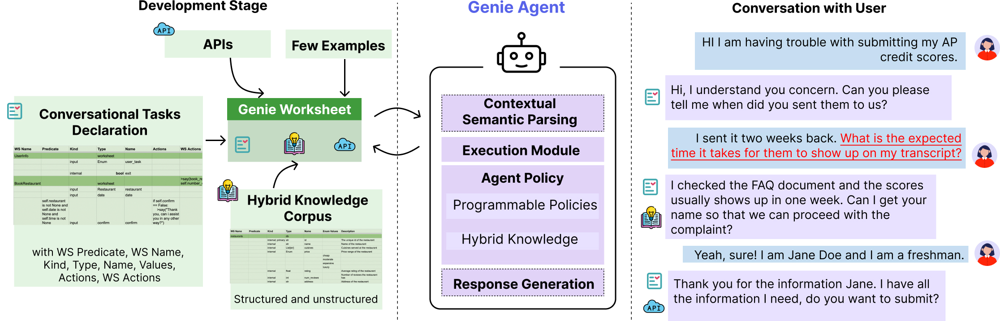

This repository is Katherine Wong and Priyanka Gupta's final project for CS 224V: Conversational Virtual Assistants with Deep Learning. The Dog Adoption Assistant helps users answer any questions about various dog breeds, find dog breeds that suit their needs, and search for dog adoption listings in the user's area. 

In order to run the agent, follow the provided steps:
1) Clone the repository on your device
2) Run the following commands:
```python
conda deactivate
source .venv/bin/activate
uv venv
uv add requests
python3 experiments/agents/dog_adoption/dog_adoption.py
```
To run the frontend, run the following commands instead of the last line of the above block:
```python
cd experiments/agents/dog_adoption/frontend
chainlit run app_dog_adoption.py --port 8800 
```
Running this command should launch a window in your browser to a locally-hosted frontend UI, where you can interact with the agent.

When a user inputs a query related to fetching information about a dog breed (i.e. "What is the energy level of a chihuahua?" or "Find me dog breeds with low shedding levels"), the agent will create a SQL query and run the SQL query on the database; finally, once it gets the given information, it will report it back to the user. In order for this to work properly, you must also host the database via PostgreSQL on your own device. The dataset we used is linked at the bottom of this section.

When a user inputs a query related to searching for dog adoption listings, the agent will call the AdoptAPet API and report the results back to the user. Behind the scenes, we've written additional functions that call the AdoptAPet API using the Python requests module and process its JSON outputs. The adoption search task takes in the following parameters: city_or_zip (US zip code or CA postal code (with space), or "City, ST" to search for adoption listings in), geo_range (miles/km to search for around the given city or zip code), breed (the user's desired breed that they want to search for), age (the age category of the dog in the adoption listing — either "puppy", "young", "adult", or "senior"), and sex (the sex/gender of the dog in the adoption listing – either "m" or "f"). The parameters city_or_zip and geo_range are required.

You must also need to set the LLM key as an environment variable. Directions on how to do so are at the bottom of this ReadMe.

Important Links:
- [Genie Worksheet Google Sheet](https://docs.google.com/spreadsheets/d/12fiyfwVRN5IHh_qIZnN7FfonB4lzkBvhUtedXzdur0k/edit?usp=sharing)
- [Demo Video (Longer)](https://drive.google.com/file/d/13TRpZPiiDxfP10KBwlop0IVgNkj_L96x/view?usp=sharing)
- [Demo Video (Short <1 Minute)](https://drive.google.com/file/d/1sjvQ0_ICyAL96XbevSpK3NdLQM_zSxXK/view?usp=drive_link)
- [Kaggle Dataset](https://www.kaggle.com/datasets/warcoder/dog-breeds-details)
- [AdoptAPet API Documentation](https://partner-apis.adoptapet.com/)

***

<p align="center">
    <h1 align="center">
        
        <br>
        <b>GenieWorksheets</b>
        <br>
        <a href="https://arxiv.org/abs/2407.05674">
            
        </a>
    </h1>
</p>
<p align="center">
    Framework for creating reliable conversational agents
</p>


Genie is a programmable framework for creating task-oriented conversational
agents that are designed to handle complex user interactions and knowledge
access. Unlike LLMs, Genie provides reliable grounded responses, with 
controllable agent policies through its expressive specification, Genie 
Worksheet. In contrast to dialog trees, it is resilient to diverse user queries,
helpful with knowledge sources, and offers ease of programming policies through
 its declarative paradigm.

[Research Preprint](https://arxiv.org/abs/2407.05674)



## Installation

To install Genie, we recommend using uv ([UV installation guide](https://github.com/astral-sh/uv?tab=readme-ov-file#installation))


```bash
git clone https://github.com/stanford-oval/worksheets.git
cd worksheets
uv venv
source venv/bin/activate
uv sync
```

## Creating Agents

Example agents are present in `experiments/agents/` directory. You can use them
as a reference to create your own agents.

### Load the model configuration

```python
from yaml import safe_load


with open("model_config.yaml", "r") as f:
    model_config = safe_load(f)
```

### Define your Knowledge Sources

```python
from worksheets.knowledge import SUQLKnowledgeBase

suql_knowledge = SUQLKnowledgeBase(
    llm_model_name="gpt-4o", # model name
    tables_with_primary_keys={
        "restaurants": "_id", # table name and primary key
    },
    database_name="restaurants", # database name
    embedding_server_address="http://127.0.0.1:8509",  # embedding server address for free text
    source_file_mapping={
        "course_assistant_general_info.txt": os.path.join(
            current_dir, "course_assistant_general_info.txt"
        ) # mapping of free-text files with the path
    },
    db_host="127.0.0.1", # database host
    db_port="5432", # database port
    postprocessing_fn=postprocess_suql,  # optional postprocessing function
    result_postprocessing_fn=None,  # optional result postprocessing function
)
```

### Define your Knowledge Parser

1. REACT Multi-agent parser

```python
from worksheets.knowledge import SUQLReActParser

suql_react_parser = SUQLReActParser(
    llm_model_name="azure/gpt-4o",  # model name
    example_path=os.path.join(current_dir, "examples.txt"),  # path to examples
    instruction_path=os.path.join(current_dir, "instructions.txt"),  # path to domain-specific instructions
    table_schema_path=os.path.join(current_dir, "table_schema.txt"),  # path to table schema
    knowledge=suql_knowledge,  # previously defined knowledge source
)
```

2. Simple LLM Parser

```python
from worksheets.knowledge import SUQLParser

suql_parser = SUQLParser(
    llm_model_name="azure/gpt-4o",
    prompt_selector=None,  # optional function that helps in selecting the right prompt
    knowledge=suql_knowledge,
),
```

### Define the Agent

```python
from worksheets.agent import Agent
course_assistant_bot = Agent(
    botname="YelpBot",
    description="You an assistant at Yelp and help users with all their queries related to booking a restaurant. You can search for restaurants, ask me anything about the restaurant and book a table.",
    prompt_dir=prompt_dir,  # directory for prompts
    starting_prompt="""Hello! I'm YelpBot. I'm here to help you find and book restaurants in four bay area cities **San Francisco, Palo Alto, Sunnyvale, and Cupertino**. What would you like to do?""",
    args={},  # additional arguments
    api=[book_restaurant_yelp],  # optional API functions
    knowledge_base=suql_knowledge,  # previously defined knowledge source
    knowledge_parser=suql_parser,  # previously defined knowledge parser
).load_from_gsheet(gsheet_id="ADD YOUR SPREADSHEET ID HERE",)
```


### Run the conversation loop

```python
from asyncio import run
from worksheets.interface_utils import conversation_loop

asyncio.run(conversation_loop(course_assistant_bot, output_state_path="yelp_bot.json"))
```


### Add prompts
For each agent you need to create prompts for:
- Semantic parsing: `semantic_parsing.prompt`
- Response generation: `response_generator.prompt`

Place these prompts in the prompt directory that you specify while creating the
agent.

You can copy basic annotated prompts from `experiments/sample_prompts/` 
directory. Make change where we have `TODO`. You need two provide a few 
guidelines in the prompt that will help the LLM to perform better and some 
examples. Please `experiments/agents/course_enroll/prompts/` for inspiration!


### Spreadsheet Specification

To create a new agent, you should have a Google Service Account and create a new spreadsheet. 
You can follow the instructions [here](https://cloud.google.com/iam/docs/service-account-overview) to create a Google Service Account.
Share the created spreadsheet with the service account email.

You should save the service_account key as `service_account.json` in the `worksheets/` directory.

Here is a starter worksheet that you can use for your reference: [Starter Worksheet](https://docs.google.com/spreadsheets/d/1ST1ixBogjEEzEhMeb-kVyf-JxGRMjtlRR6z4G2sjyb4/edit?usp=sharing)

Here is a sample spreadsheet for a restaurant agent: [Restaurant Agent](https://docs.google.com/spreadsheets/d/1FXg5VFrdxQlUyld3QmKKL9BN1lLIhAtQTJjCHyNOU_Y/edit?usp=sharing)

Please note that we only use the specification defined in the first sheet of the spreadsheet.

### Running the Agent (Web Interface)

Create a folder `frontend/`  under `experiments/agents/<agent_name>` and create a `app_*` file.

You can run the agent in a web interface by running:

**NOTE:** You should run the agent in the `frontend` directory to preserve the frontend assets.

For restaurant agent:
```bash
cd experiments/agents/yelpbot/frontend/
chainlit run app_restaurant.py --port 8800
```

## Set LLM Config
To use Azure OpenAI you need to set the following environment variables:
```
export AZURE_OPENAI_WS_KEY="<AZURE OPENAI WS KEY>"
export AZURE_WS_ENDPOINT="<AZURE WS ENDPOINT>"
export AZURE_WS_API_VERSION="<AZURE WS API VERSION>"
```

To use OpenAI you need to set the following environment variables:
```
export OPENAI_API_KEY="<OPENAI API KEY>"
```

To use Together AI you need to set the following environment variables:
```
export TOGETHER_API_KEY="<TOGETHER AI API KEY>"
```

## Cite our work

If you use Genie in your research or applications, please cite our work:

```
@article{genieworksheets,
  title={Coding Reliable LLM-based Integrated Task and Knowledge Agents with GenieWorksheets},
  author={Joshi, Harshit and Liu, Shicheng and Chen, James and Weigle, Robert and Lam, Monica S},
  journal={arXiv preprint arXiv:2407.05674},
  year={2024}
}
```

GenieWorksheets logo is designed with the help of DALL-E.
